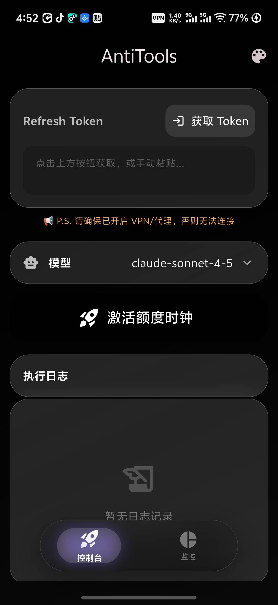
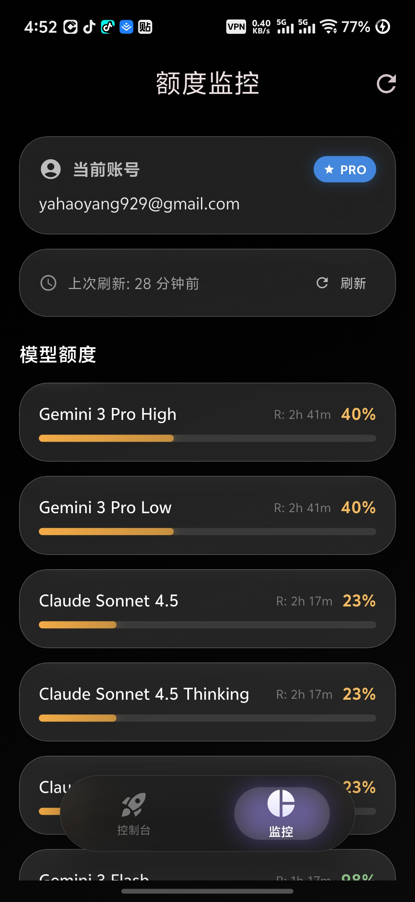

# AntiTools 🛡️

**AntiTools** 是一款极简的 API 额度监控与激活助手。

## ✨ 核心功能

*   **⚡ 额度激活**：一键发送请求激活/重置 API 额度时钟，确保周期正常刷新。
*   **📊 额度监控**：实时查询 Gemini & Claude 系列模型的剩余配额与重置时间。
*   **🎨 极致体验**：全应用采用高斯模糊设计，流体渐变背景，支持动态主题。
*   **🔐 安全便捷**：内置 Google OAuth 流程，Token 本地加密存储。

##  最佳实践：额度最大化策略

利用 AntiTools 的移动端特性，您可以在不打开电脑的情况下，通过策略性激活来最大化工作时间的可用额度。

**场景目标**：解决额度不够用，覆盖 9:00 - 18:00 工作时间，充分利用更多额度。

1.   **07:00 (起床/通勤)**：在手机上点击 **"激活"**。此时 API 时钟开始倒计时（约 5 小时重置）。
2.   **09:00 (上班)**：开始工作，此时您拥有 **第 1 管** 满额度。
3.   **12:00 (午休)**：上午激活的时钟到期重置。下午工作开始时，您将获得 **第 2 管** 满额度。
4.   **17:00 (下班前)**：额度再次重置。您将获得 **第 3 管** 额度，从容应对下班前的突发需求或加班。

无需电脑，随时随地掌控额度节奏。


## 📱 截图展示

<div align="center">
  
  
</div>

## 快速开始

### 下载安装
直接前往 [Releases](../../releases) 页面下载最新 APK 安装即可。

### 本地构建
```bash
# 运行
flutter pub get
flutter run
# 构建 APK
flutter build apk --release
```
